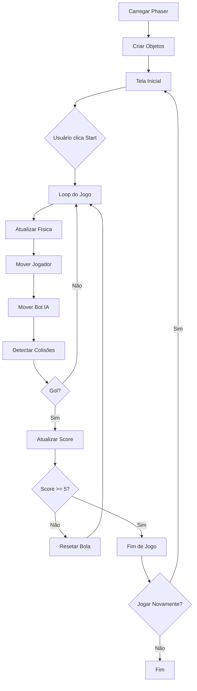

# 🎮 Pong - Clássico Reimaginado


> Implementação moderna do clássico jogo Pong com física realista e IA inteligente baseada em predição cinemática.

## 📋 Índice

- [Visão Geral](#visão-geral)
- [Física do Jogo](#física-do-jogo)
- [Equações Matemáticas](#equações-matemáticas)
- [Inteligência Artificial](#inteligência-artificial)
- [Instalação](#instalação)
- [Como Jogar](#como-jogar)
- [Configuração](#configuração)
- [Arquitetura](#arquitetura)
- [Deploy](#deploy)
- [Desenvolvimento](#desenvolvimento)

---

## 🎯 Visão Geral

Jogo Pong desenvolvido com **Phaser 3**, implementando física baseada em cinemática clássica. O jogo apresenta:

- ✅ Física realista com colisões elásticas
- ✅ IA com predição de trajetória
- ✅ Interface responsiva (desktop e mobile)
- ✅ Controles touch e teclado
- ✅ Aceleração progressiva da bola
- ✅ Sistema de pontuação até 5 pontos

### Tecnologias

- **Engine:** Phaser 3.55.2
- **Linguagem:** JavaScript (ES6+)
- **Física:** Arcade Physics
- **Renderização:** Canvas 2D

---

## 🔬 Física do Jogo

### 1. Sistema de Coordenadas

```
(0,0) ━━━━━━━━━━━━━━━━━━━━━━━━━━━ (800,0)
  │                                    │
  │          Canvas 800x600           │
  │                                    │
(0,600) ━━━━━━━━━━━━━━━━━━━━━━━━ (800,600)
```

**Origem:** Canto superior esquerdo  
**Eixo X:** Positivo para direita  
**Eixo Y:** Positivo para baixo

### 2. Movimento Retilíneo Uniforme (MRU)

Todos os objetos do jogo seguem MRU entre colisões:

```
s(t) = s₀ + v·Δt
```

**Onde:**
- `s(t)` = posição no tempo t
- `s₀` = posição inicial
- `v` = velocidade constante
- `Δt` = intervalo de tempo

#### Decomposição em 2D

```javascript
x(t) = x₀ + vₓ·Δt
y(t) = y₀ + vᵧ·Δt
```

**Implementação no código:**
```javascript
// Phaser atualiza automaticamente a cada frame (~60 FPS)
ball.body.setVelocity(vx, vy);
// Internamente: position += velocity * deltaTime
```

### 3. Colisões Elásticas

#### 3.1 Colisão com Paredes (Reflexão Especular)

**Lei da Reflexão:** Ângulo de incidência = Ângulo de reflexão

```
θᵢ = θᵣ
```

**Componentes da velocidade:**
```javascript
// Parede horizontal (topo/fundo)
vₓ_nova = vₓ_antiga          // Mantém
vᵧ_nova = -vᵧ_antiga         // Inverte

// Parede vertical (laterais = GOL)
// Não há reflexão, ponto é marcado
```

**Coeficiente de restituição:** `e = 1.0` (perfeitamente elástica)

#### 3.2 Colisão com Raquetes

**Ângulo de reflexão variável baseado na posição do impacto:**

```
y_relativo = (y_bola - y_raquete) / (altura_raquete / 2)

θ_reflexão = y_relativo × 45°
```

**Onde:**
- `y_relativo ∈ [-1, 1]`
- `θ_reflexão ∈ [-45°, 45°]`

**Exemplo visual:**
```
      ┌─────┐
      │ -1  │  ← Topo: θ = -45° (para cima)
      │  0  │  ← Centro: θ = 0° (reto)
      │ +1  │  ← Base: θ = +45° (para baixo)
      └─────┘
```

**Cálculo da nova velocidade:**

```javascript
// 1. Calcular posição relativa
const relativeY = (ball.y - paddle.y) / (PADDLE_HEIGHT / 2);

// 2. Converter para ângulo
const bounceAngle = relativeY * (Math.PI / 4);  // ±45° em radianos

// 3. Calcular velocidade atual
const currentSpeed = Math.sqrt(vₓ² + vᵧ²);

// 4. Aplicar aceleração (5% por colisão)
const newSpeed = Math.min(currentSpeed * 1.05, MAX_BALL_SPEED);

// 5. Decompor velocidade
const direction = isPaddleLeft ? 1 : -1;
vₓ_nova = Math.cos(bounceAngle) × direction × newSpeed;
vᵧ_nova = Math.sin(bounceAngle) × newSpeed;
```

### 4. Aceleração Progressiva

A bola acelera **5% a cada colisão** com raquetes:

```
v_nova = min(v_atual × 1.05, v_max)
```

**Progressão da velocidade:**
```
Colisão  │ Velocidade (px/s) │ % do máximo
─────────┼───────────────────┼─────────────
Inicial  │ 300               │ 50%
1ª       │ 315               │ 52.5%
2ª       │ 331               │ 55.2%
5ª       │ 383               │ 63.8%
10ª      │ 489               │ 81.5%
20ª      │ 600 (MAX)         │ 100%
```

**Constantes:**
- `INITIAL_BALL_SPEED = 300` px/s
- `MAX_BALL_SPEED = 600` px/s
- `ACCELERATION_FACTOR = 1.05`

---

## 📐 Equações Matemáticas

### Cinemática Básica

#### Posição em função do tempo
```
→r(t) = →r₀ + →v·t
```

**Componentes:**
```
x(t) = x₀ + vₓ·t
y(t) = y₀ + vᵧ·t
```

#### Velocidade escalar
```
v = √(vₓ² + vᵧ²)
```

#### Conversão ângulo ↔ velocidade
```
vₓ = v·cos(θ)
vᵧ = v·sin(θ)

θ = arctan(vᵧ / vₓ)
```

### Predição de Trajetória (IA)

#### Tempo até interceptação
```
Δx = x_alvo - x_bola
t_interceptação = Δx / vₓ
```

**Condição:** `vₓ > 0` (bola se aproximando)

#### Posição futura
```
y_futuro = y_atual + vᵧ·t_interceptação
```

#### Simulação de reflexões
```python
while y_futuro < 0 or y_futuro > 600:
    if y_futuro < 0:
        y_futuro = -y_futuro          # Espelhamento superior
    if y_futuro > 600:
        y_futuro = 1200 - y_futuro    # Espelhamento inferior
```

**Fórmula generalizada para n reflexões:**
```
y_final = |y_inicial mod 1200|
if y_final > 600:
    y_final = 1200 - y_final
```

### Movimento da Raquete do Bot

#### Velocidade proporcional com saturação
```
Δy = y_alvo - y_atual
v_bot = sgn(Δy) × min(v_max, |Δy| × k)
```

**Onde:**
- `sgn(Δy)` = sinal de Δy (+1 ou -1)
- `v_max = 6` px/frame = velocidade máxima
- `k = 0.2` = constante de proporcionalidade
- `|Δy|` = distância absoluta até alvo

**Gráfico velocidade × distância:**
```
v_bot│     
  6  ├─────────────────  (saturação)
     │        /
  3  │      /
     │    /
  0  ├──┴────────────────
     0   30         Δy
```

---

## 🤖 Inteligência Artificial

### Algoritmo de Decisão

```javascript
function moveBot() {
    // Estado padrão: retornar ao centro
    let targetY = 300;
    
    // Apenas reagir se bola vem em direção ao bot
    if (ball.velocity.x > 0) {
        const timeToReach = (BOT_X - ball.x) / ball.velocity.x;
        
        // Janela de predição: 0 a 3 segundos
        if (timeToReach > 0 && timeToReach < 3) {
            // Calcular posição futura
            targetY = predictBallPosition(ball, timeToReach);
            
            // Adicionar erro humano (15%)
            const humanError = (Math.random() - 0.5) * PADDLE_HEIGHT * 0.15;
            targetY += humanError;
        }
    }
    
    // Movimento suave em direção ao alvo
    moveTowardsTarget(bot, targetY);
}
```

### Características da IA

| Parâmetro | Valor | Descrição |
|-----------|-------|-----------|
| **Velocidade** | 6 px/frame | 25% mais lento que jogador |
| **Dificuldade** | 0.15 | Erro de ±15 pixels |
| **Janela predição** | 3 segundos | Ignora bolas muito distantes |
| **Suavização** | 0.2 | Fator de aceleração proporcional |

### Níveis de Dificuldade (configurável)

```javascript
const DIFFICULTY_LEVELS = {
    EASY:   { error: 0.30, speed: 4 },  // Erro ±30px, lento
    MEDIUM: { error: 0.15, speed: 6 },  // Erro ±15px, normal
    HARD:   { error: 0.05, speed: 8 },  // Erro ±5px, rápido
    EXPERT: { error: 0.00, speed: 10 }  // Perfeito (não recomendado!)
};
```

### Taxa de Acerto Estimada

```
Taxa_acerto = 1 - (erro / altura_raquete)
             = 1 - (15 / 100)
             = 0.85 = 85%
```

O bot acerta aproximadamente **85% das bolas**, criando um jogo desafiador mas vencível.

---

## 🚀 Instalação

### Método 1: Executar Localmente

```bash
# 1. Clone o repositório
git clone https://github.com/seu-usuario/pong-game.git
cd pong-game

# 2. Abra o arquivo HTML
# Opção A: Servidor local Python
python3 -m http.server 8000

# Opção B: Servidor local Node.js
npx http-server

# 3. Acesse no navegador
# http://localhost:8000
```

### Método 2: Abrir Direto

Simplesmente abra `index.html` em um navegador moderno.

### Requisitos

- **Navegador:** Chrome 90+, Firefox 88+, Safari 14+, Edge 90+
- **JavaScript:** Habilitado
- **Conexão:** Internet (para carregar Phaser CDN)

---

## 🎮 Como Jogar

### Controles

#### Desktop
- `↑` ou `W` - Mover para cima
- `↓` ou `S` - Mover para baixo
- `Space` - Iniciar/Reiniciar jogo

#### Mobile/Touch
- Botão `↑` - Mover para cima
- Botão `↓` - Mover para baixo
- Botão na tela - Iniciar/Reiniciar

### Objetivo

1. Rebater a bola com sua raquete **AZUL**
2. Fazer a bola passar pela raquete **VERMELHA** do bot
3. Primeiro a marcar **5 pontos** vence

### Dicas

- 💡 Acerte a bola no **topo/base** da raquete para criar ângulos
- 💡 A bola **acelera** a cada rebatida
- 💡 O bot **prevê** a trajetória, mas comete erros
- 💡 Posicione-se **antecipadamente** para ter controle

---

## ⚙️ Configuração

### Constantes Modificáveis

```javascript
// Dimensões
const PADDLE_WIDTH = 20;
const PADDLE_HEIGHT = 100;
const BALL_RADIUS = 12;

// Velocidades (px/frame ou px/s)
const PLAYER_SPEED = 8;        // Jogador
const BOT_SPEED = 6;           // Bot
const INITIAL_BALL_SPEED = 300;
const MAX_BALL_SPEED = 600;

// Física
const ACCELERATION_FACTOR = 1.05;  // 5% por colisão

// IA
const BOT_DIFFICULTY = 0.15;       // 0.0 = perfeito, 1.0 = péssimo
const BOT_PREDICTION_TIME = 3;     // segundos
const BOT_SMOOTHNESS = 0.2;

// Jogo
const MAX_SCORE = 5;
```

### Personalizar Dificuldade

```javascript
// Arquivo: script dentro de <script>
// Localize a função moveBot() e altere:

const difficulty = 0.15;  // Mudar para:
// 0.05 = Difícil
// 0.15 = Médio (padrão)
// 0.30 = Fácil
// 0.50 = Muito fácil
```

### Cores

```javascript
// CSS
player: #0066ff (azul)
bot:    #ff0066 (vermelho)
ball:   #ffffff (branco)
bg:     #000000 (preto)
border: #00ff00 (verde)
```

---

## 🏗️ Arquitetura

### Estrutura de Arquivos

```
pong-game/
├── index.html          # Jogo completo (HTML + CSS + JS)
├── README.md           # Esta documentação
├── render.yaml         # Configuração deploy Render
├── package.json        # Metadados npm
└── .gitignore         # Arquivos ignorados pelo Git
```

### Fluxo do Jogo



### Funções Principais

| Função | Descrição | Frequência |
|--------|-----------|------------|
| `preload()` | Carrega assets | 1x (início) |
| `create()` | Cria objetos do jogo | 1x (início) |
| `update()` | Loop principal | ~60 FPS |
| `moveBot()` | IA do bot | ~60 FPS |
| `hitPaddle()` | Colisão com raquete | Por evento |
| `checkScore()` | Verifica gols | ~60 FPS |
| `resetBall()` | Reseta bola após gol | Por evento |
| `endGame()` | Finaliza partida | 1x (fim) |

### Ciclo de Vida

```
Inicialização → Jogo → Gol → Reset → Jogo → ... → Vitória → Reiniciar
     ↓           ↓       ↓      ↓       ↓              ↓         ↓
  create()   update() check() reset() update()     endGame() create()
```

---

## 🌐 Deploy

### Render.com (Recomendado)

```bash
# 1. Crie repositório no GitHub
git init
git add .
git commit -m "Initial commit"
git remote add origin https://github.com/seu-usuario/pong-game.git
git push -u origin main

# 2. Acesse render.com
# 3. New + → Static Site
# 4. Conecte seu repositório
# 5. Configure:
#    - Build Command: (vazio)
#    - Publish Directory: .
# 6. Deploy!
```

### Alternativas

#### GitHub Pages
```bash
# No seu repositório GitHub
Settings → Pages → Source: main branch → Save
# URL: https://seu-usuario.github.io/pong-game
```

#### Netlify Drop
1. Acesse https://app.netlify.com/drop
2. Arraste `index.html`
3. Pronto!

#### Vercel
```bash
npm i -g vercel
vercel
# Siga as instruções
```

---

## 💻 Desenvolvimento

### Estrutura do Código

```javascript
// 1. CONFIGURAÇÃO
const config = { /* Phaser config */ };

// 2. VARIÁVEIS GLOBAIS
let player, bot, ball;
let playerScore = 0, botScore = 0;

// 3. CICLO PHASER
function preload() { /* Carregar assets */ }
function create() { /* Criar objetos */ }
function update() { /* Loop principal */ }

// 4. FÍSICA
function moveBot() { /* IA */ }
function hitPaddle() { /* Colisão */ }
function checkScore() { /* Verificar gol */ }

// 5. CONTROLES
function setupControls() { /* Teclado/Touch */ }

// 6. UI
function startGame() { /* Iniciar */ }
function endGame() { /* Finalizar */ }
function resetBall() { /* Reset */ }
```

### Debug Mode

```javascript
// Ativar visualização de física
physics: {
    arcade: {
        debug: true  // Mostrar hitboxes e velocidades
    }
}
```

### Adicionar Features

#### Exemplo: Power-ups
```javascript
function createPowerUp() {
    const powerUp = this.add.circle(400, 300, 15, 0xffff00);
    this.physics.add.existing(powerUp);
    
    this.physics.add.overlap(ball, powerUp, (b, p) => {
        p.destroy();
        ball.body.setVelocity(
            ball.body.velocity.x * 1.5,
            ball.body.velocity.y * 1.5
        );
    });
}
```

#### Exemplo: Som
```javascript
function preload() {
    this.load.audio('hit', 'assets/hit.mp3');
}

function hitPaddle() {
    this.sound.play('hit');
    // ... resto do código
}
```

### Performance

**FPS Target:** 60 FPS  
**Objetos renderizados:** 4 (2 raquetes + 1 bola + linha central)  
**Cálculos por frame:** ~20 operações matemáticas

### Testes

```javascript
// Testar colisões
console.log('Ball velocity:', ball.body.velocity);
console.log('Bot target:', targetY);
console.log('Prediction time:', timeToReach);

// Testar IA
BOT_DIFFICULTY = 0;  // Bot perfeito
BOT_DIFFICULTY = 1;  // Bot péssimo
```

---

## 📊 Parâmetros Técnicos

### Performance

| Métrica | Valor | Observação |
|---------|-------|------------|
| **FPS** | 60 | Target framerate |
| **Update calls/s** | 60 | Função update() |
| **Canvas size** | 800×600 | Proporção 4:3 |
| **Objects** | 4 | 2 paddles + ball + line |
| **Physics engine** | Arcade | Phaser built-in |

### Física

| Parâmetro | Valor | Unidade |
|-----------|-------|---------|
| Velocidade inicial bola | 300 | px/s |
| Velocidade máxima bola | 600 | px/s |
| Aceleração bola | 5% | por colisão |
| Velocidade jogador | 8 | px/frame |
| Velocidade bot | 6 | px/frame |
| Elasticidade | 1.0 | coef. restituição |

### IA

| Parâmetro | Valor | Descrição |
|-----------|-------|-----------|
| Dificuldade | 0.15 | Erro relativo |
| Janela predição | 3s | Tempo máximo |
| Suavização | 0.2 | Fator movimento |
| Taxa acerto | ~85% | Estimada |

---

## 📝 Licença

MIT License - Sinta-se livre para usar, modificar e distribuir.

---

## 🤝 Contribuindo

Contribuições são bem-vindas! Para mudanças importantes:

1. Fork o projeto
2. Crie uma branch (`git checkout -b feature/NovaFeature`)
3. Commit suas mudanças (`git commit -m 'Adiciona NovaFeature'`)
4. Push para a branch (`git push origin feature/NovaFeature`)
5. Abra um Pull Request

---

## 📧 Contato

- **Autor:** Seu Nome
- **GitHub:** [@JeniferGoncalvesDaSilvaDev](https://github.com/JeniferGoncaovesDaSilvaDev)
- **Email:** jenifer47silva@gmail.com

---

## 🙏 Agradecimentos

- **Phaser Team** - Framework de jogos incrível
- **Atari** - Pong original (1972)
- **Comunidade** - Por jogar e dar feedback

---

## 📚 Referências

### Física
- **Cinemática Clássica:** Halliday & Resnick, "Fundamentos de Física"
- **Colisões Elásticas:** https://en.wikipedia.org/wiki/Elastic_collision

### Desenvolvimento
- **Phaser 3 Docs:** https://photonstorm.github.io/phaser3-docs/
- **Arcade Physics:** https://phaser.io/tutorials/arcade-physics

### Inspiração
- **Pong Original (1972):** https://en.wikipedia.org/wiki/Pong
- **Game Programming Patterns:** https://gameprogrammingpatterns.com/

---

<div align="center">

**⭐ Se gostou do projeto, deixe uma estrela! ⭐**


</div>
